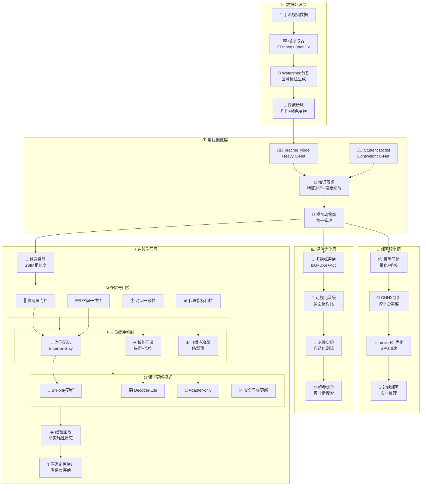

# Project Structure


✅ = 已实现  🚧 = 部分实现  📋 = 计划中  🆕 = 最新添加

```
Cholecyst-and-Instrument-Segmentation-Model/
├─ README.md                          # ✅ 项目简介
├─ LICENSE                            # ✅ 许可证声明
├─ PROJECT_STRUCTURE.md               # ✅ 项目结构文档
├─ .gitignore                         # ✅ Git忽略文件列表
│
├─ configs/                           # ✅ YAML配置文件，统一管理参数（Single Source of Truth）
│  ├─ universal_template_config.yaml # ✅ 通用多分类训练配置模板
│  ├─ binary_template_config.yaml    # 🆕 二分类专用配置模板
│  ├─ datasets/                       # 🚧 数据集配置目录
│  │  ├─ cholec80.yaml               # 📋 Cholec80数据集路径与参数
│  │  └─ endovis.yaml                # 📋 EndoVis数据集路径与参数
│  ├─ offline/                        # 🚧 离线阶段（重模型训练）参数目录
│  │  ├─ baseline_min.yaml           # ✅ 极简配置（可选，不想配也可用命令行）
│  │  ├─ unetpp_deeplabv3.yaml       # 📋 U-Net++和DeepLabV3配置
│  │  └─ hrnet.yaml                  # 📋 HRNet配置
│  ├─ online/                         # 🚧 在线阶段（轻量模型与自适应）参数目录
│  │  ├─ default_online.yaml         # 📋 默认在线推理参数（阈值、滑窗大小等）
│  │  ├─ gating.yaml                 # 📋 多信号权重配置
│  │  ├─ conservative_update.yaml     # 📋 BN-only / Decoder-lite / Adapter-only配置
│  │  ├─ buffer_trio.yaml            # 📋 缓冲机制（迟滞、冷却、回滚）
│  │  └─ escalation.yaml             # 📋 安全模式切换规则
│  └─ ablations/                      # 🚧 消融实验配置目录
│     ├─ offline_only.yaml           # 📋 仅离线模型
│     ├─ online_naive.yaml           # 📋 简单在线更新
│     ├─ no_entropy_gate.yaml        # 📋 无熵门控
│     ├─ no_buffer_trio.yaml         # 📋 无缓冲机制
│     └─ bn_only.yaml                # 📋 仅BN更新
│
├─ data/                              # ✅ 数据集元信息或软链接（原数据不放入仓库）
│  └─ README.md                      # 📋 数据挂载说明
│
├─ checkpoints/                       # ✅ 模型权重（离线重模型、蒸馏模型、EMA快照）
│
├─ logs/                              # ✅ 日志（tensorboard、JSON、事件追踪）
│
├─ outputs/                           # ✅ 推理结果、可视化、表格
│
├─ docs/                              # ✅ 文档与图表
│  └─ diagrams/                      # ✅ Mermaid流程图目录
│
├─ scripts/                           # ✅ 命令行脚本（可复现运行）
│  ├─ seg8k_fetch.py                 # ✅ 数据集下载脚本
│  ├─ demo_multiclass_color.py       # ✅ 多类分割可视化演示脚本
│  ├─ validate_watershed_mechanism.py # 🆕 Watershed机制验证脚本（含真实模型预测）
│  ├─ train_monitor.py               # ✅ 训练监控模块（已移至src/common/）
│  ├─ train_offline.sh               # 📋 离线训练入口
│  ├─ distill.sh                     # 📋 重→轻蒸馏
│  ├─ export_onnx.sh                 # 📋 导出ONNX模型（TRT加速）
│  ├─ run_online.sh                  # 📋 在线推理入口
│  ├─ ablation_suite.sh              # 📋 批量运行消融实验
│  └─ eval_offline.sh                # 📋 离线模型验证
│
├─ notebooks/                         # ✅ Jupyter实验笔记
│  ├─ 01_data_checks.ipynb           # 📋 数据检查
│  ├─ 02_entropy_threshold_sweep.ipynb # 📋 熵阈值调优
│  └─ 03_runtime_budget.ipynb        # 📋 运行时资源评估
│
├─ docker/                            # ✅ Docker环境
│  ├─ environment.yml                # ✅ Conda环境配置
│  └─ Dockerfile                     # 📋 容器构建文件
│
├─ tests/                             # ✅ 核心功能单元测试目录
│  ├─ test_entropy.py                # 📋 熵计算测试
│  ├─ test_gating.py                 # 📋 门控逻辑测试
│  ├─ test_hysteresis.py             # 📋 迟滞机制测试
│  ├─ test_rollback.py               # 📋 回滚机制测试
│  └─ test_pseudo_labels.py          # 📋 伪标签生成测试
│
├─ utils/                             # 🆕 实用工具模块
│  ├─ ReadMe.md                      # ✅ 工具模块说明文档
│  ├─ class_frame_extractor.py       # 🆕 视频帧提取工具（支持FFmpeg和OpenCV双模式）
│  └─ class_distillation.py          # 🆕 知识蒸馏框架（损失函数+特征提取器）
│  └─ class_frame_to_video.py        # 🆕 帧合并视频工具
│
├─ src/                               # ✅ 核心源代码
   ├─ common/                        # ✅ 公共工具
   │  ├─ constants.py                # ✅ 全局常量定义（CLASSES、PALETTE、IGNORE_INDEX）
   │  ├─ output_manager.py           # ✅ 输出目录管理和结果保存
   │  └─ train_monitor.py            # ✅ 训练监控模块（单行刷新、GPU监控、进度条、ETA预估）
   ├─ dataio/                        # ✅ 数据加载与预处理
   │  └─ datasets/                   # ✅ 数据集类
   │     └─ seg_dataset_min.py       # ✅ 最小数据集类（images/、masks/，支持二分类/多分类切换）
   ├─ eval/                          # ✅ 评估模块
   │  └─ evaluator.py                # ✅ 分割指标评估器（IoU、Dice、Accuracy等，支持二分类/多分类）
   ├─ models/                        # ✅ 模型结构
   │  ├─ model_zoo.py                # ✅ 模型动物园（统一模型构建和管理）
   │  ├─ baseline/                   # ✅ 基线模型
   │  │  └─ unet_min.py              # ✅ 最小 U-Net
   │  ├─ offline/                    # ✅ 离线重模型目录（预留）
   │  └─ online/                     # ✅ 在线/轻量模型
   │     ├─ mobile_unet.py           # ✅ MobileNet风格的轻量U-Net（深度可分离卷积）
   │     └─ adaptive_unet.py         # ✅ 自适应U-Net（带适配器层，支持在线学习）
   ├─ training/                      # ✅ 训练流程
   │  ├─ offline/                    # ✅ 离线训练模块
   │  │  ├─ train_offline_min.py     # ✅ 最小离线训练（1个epoch测试）+ 🔄 可集成监控
   │  │  └─ train_offline_universal.py # ✅ 通用离线训练模板（集成监控、可视化、评估，支持二分类/多分类）
   │  └─ online/                     # ✅ 在线训练模块
   │     └─ adaptive_unet_main.py    # ✅ 在线自适应学习主程序（帧选择、经验回放、在线训练）
   ├─ metrics/                       # 📋 评估模块（已移至src/eval/）
   │  └─ evaluator.py                # 📋 分割指标评估器（已移至src/eval/evaluator.py）
   ├─ online/                        # 📋 在线推理与安全机制（规划中）
   │  ├─ safety_controller.py        # 📋 完整安全控制器（多信号门控+三重缓冲）
   │  ├─ gating_system.py           # 📋 多信号门控系统（熵/空间/时间/代理一致性）
   │  ├─ buffer_mechanisms.py       # 📋 三重缓冲机制（滞回记忆+智能回滚+自适应冷却）
   │  └─ conservative_updater.py    # 📋 保守更新模式（BN-only/Decoder-Lite/Adapter-only）
   └─ viz/                          # ✅ 可视化工具
      ├─ colorize.py                 # ✅ 颜色映射和可视化函数（id_to_color、make_triplet、overlay）
      └─ visualizer.py               # ✅ 可视化器（预测结果、叠加图像，支持任务自动检测）
```

## 🔒 在线学习安全机制详解

### 🎯 安全机制设计原理

我们的在线学习系统采用**多层次防护架构**，确保模型在实时更新过程中不会发生灾难性遗忘或性能退化：

### 🔒 多信号门控系统 (Multi-Signal Gating)

#### 1. 熵阈值门控 (Entropy-Based Gating)
- **原理**: 利用预测熵衡量模型对像素分类的确信度
- **实现**: 
  - 计算像素级预测熵: `H = -Σ p_i * log(p_i)`
  - 设置双阈值过滤: 固定阈值 + 自适应百分位阈值
  - 仅更新低熵（高置信度）区域的参数
- **防护效果**: 避免在模糊区域进行误导性更新

#### 2. 空间一致性检查 (Spatial Consistency Verification)
- **原理**: 检查预测结果的空间连通性和形态学合理性
- **实现**:
  - 连通组件分析: 过滤小于阈值的碎片区域
  - 形态学过滤: 开运算去噪 + 闭运算填洞
  - 区域大小验证: 确保预测区域符合医学常识
- **防护效果**: 防止空间不连续的错误预测干扰训练

#### 3. 时间一致性门控 (Temporal Consistency Gating)
- **原理**: 跨帧对齐检测，确保预测时间连贯性
- **实现**:
  - 帧间IoU计算: 与历史N帧预测的平均对齐度
  - 时间平滑: 加权平均历史预测，抑制突变
  - 一致性阈值: 低于阈值时拒绝更新
- **防护效果**: 避免因单帧异常导致的模型震荡

#### 4. 代理指标门控 (Proxy Metrics Gating)
- **原理**: 使用快速计算的代理指标评估预测质量
- **实现**:
  - 灰度变化监控: 检测输入图像的复杂度变化
  - 预测稳定性: IoU/Dice分数的变化幅度
  - 置信度分布: 预测概率的分布特征分析
- **防护效果**: 提供多维度的质量评估，增强门控的鲁棒性

### 🌀 三重缓冲保护机制 (Triple-Buffer Protection)

#### 1. 滞回记忆系统 (Hysteresis Memory System)
- **设计原理**: 类似电子电路中的施密特触发器，避免临界状态震荡
- **实现机制**:
  - **Enter阈值**: 置信度需超过高阈值(0.8)才进入更新状态
  - **Stay阈值**: 进入后只需保持中阈值(0.6)即可继续更新
  - **记忆窗口**: 维护最近N帧的置信度历史，平滑决策
- **防护效果**: 防止在临界置信度附近的频繁切换

#### 2. 智能回滚机制 (Intelligent Rollback System)
- **设计原理**: 周期性保存模型快照，性能下降时自动回滚
- **实现机制**:
  - **快照策略**: 每N帧保存一次模型状态和性能指标
  - **性能监控**: 实时跟踪IoU/Dice等指标的变化趋势
  - **回滚触发**: 性能下降超过阈值(15%)时自动回滚到最佳快照
  - **快照选择**: 选择历史性能最优的快照进行恢复
- **防护效果**: 提供"时光机"般的恢复能力，确保模型性能不会持续退化

#### 3. 自适应冷却期 (Adaptive Cooldown Period)
- **设计原理**: 在检测到问题后强制进入"冷静期"，避免连续错误
- **实现机制**:
  - **触发条件**: 回滚执行、连续更新失败、异常检测
  - **冷却时长**: 基础时长 × (严重性系数 + 历史回滚次数 × 0.5)
  - **渐进恢复**: 冷却期内禁止所有更新，期满后逐步恢复
- **防护效果**: 给模型"冷静时间"，防止错误的连锁反应

### ⚖️ 保守更新模式 (Conservative Update Modes)

#### 1. BN-only更新模式
- **适用场景**: 中等置信度(0.7-0.9)，需要轻微适应
- **更新策略**: 仅更新BatchNorm层的运行统计量
- **技术细节**: 冻结所有权重参数，仅前向传播更新BN统计
- **安全性**: 最保守的更新方式，几乎不改变模型行为

#### 2. Decoder-Lite更新模式  
- **适用场景**: 高置信度(0.9+)，需要局部微调
- **更新策略**: 仅更新解码器部分，编码器保持冻结
- **技术细节**: 小学习率(0.1x) + 梯度裁剪 + 少步更新(3-5步)
- **安全性**: 保持特征提取能力，仅调整决策边界

#### 3. Adapter-only更新模式
- **适用场景**: 需要快速适应新的数据分布
- **更新策略**: 仅更新专门的适配器层参数
- **技术细节**: 轻量级适配器插入到主干网络中
- **安全性**: 保持主体网络稳定，适配器提供灵活性

#### 4. 安全子集更新模式
- **适用场景**: 极高置信度区域的精细调优
- **更新策略**: 仅对高置信度像素计算梯度和更新
- **技术细节**: 基于置信度mask的选择性反向传播
- **安全性**: 确保只有最可信的信号参与模型更新

### 🎛️ 安全机制协调工作流程


### 📊 安全机制配置文件结构

我们将在 `configs/online/safety_mechanisms.yaml` 中提供可调参数


### 🆕 通用训练模板 (`src/training/offline/train_offline_universal.py`)
- **功能**: 集成监控、可视化、评估的通用训练框架
- **特点**: 
  - 实时进度监控（单行刷新）
  - GPU使用率和内存监控
  - 自动模型保存和指标记录
  - 可视化结果自动生成
  - 易于适配不同模型架构
  - **🔥 支持二分类和多分类分割任务无缝切换**
  - 模型插拔机制（通过model_zoo统一管理）
  - 支持YAML配置文件和命令行参数双重配置

### 🆕 二分类/多分类切换机制
- **核心原理**: 通过`--binary`标志和`return_multiclass`参数实现零风险任务切换
- **切换路径**:
  - **数据层**: SegDatasetMin根据`return_multiclass`参数调整标签格式
  - **模型层**: 自动调整输出通道数（二分类1通道，多分类N通道）
  - **评估层**: Evaluator自动检测任务类型并选择相应评估方法
  - **可视化层**: Visualizer自动适配任务类型的颜色映射
- **配置模板**: 
  - `configs/universal_template_config.yaml`: 多分类配置
  - `configs/binary_template_config.yaml`: 二分类配置

### 🆕 视频帧提取工具 (`utils/class_frame_extractor.py`)
- **功能**: 从手术视频中批量提取帧用于数据集构建
- **特点**:
  - 支持FFmpeg和OpenCV双模式切换
  - 灵活的帧率控制（fps或every_n）
  - 时间窗口提取（start-end）
  - 自动大小调整和质量控制
  - 批量分包机制（可选）
  - 多种输出格式支持
- **应用**: 快速构建训练数据集，扩展数据源

### 🆕 知识蒸馏框架 (`utils/class_distillation.py`)
- **核心组件**:
  - `DistillationLoss`: 综合蒸馏损失（任务损失+蒸馏损失+特征损失）
  - `FeatureExtractor`: 自动特征提取和Hook管理
- **特点**:
  - 温度缩放控制蒸馏强度
  - 多层特征对齐
  - 自动尺寸适配
  - 损失权重可调
- **应用**: 大模型→小模型知识转移，部署优化

### 🆕 Watershed机制验证工具 (`scripts/validate_watershed_mechanism.py`)
- **功能**: 深度分析Watershed分割机制的学习过程
- **核心分析**:
  - Watershed区域重新编号机制验证
  - 训练时类别映射过程可视化
  - 真实模型预测结果对比
  - 6面板综合可视化（原图→watershed→GT→预测）
- **关键洞察**: 证明模型学习的是语义理解而非灰度值记忆
- **应用**: 机制解释、论文撰写、算法验证

### 🆕 训练监控模块 (`src/common/train_monitor.py`)
- **功能**: 提供训练过程的实时监控和状态显示
- **特点**:
  - 单行刷新进度显示
  - CPU/GPU资源监控
  - 训练时间统计和ETA剩余时间预估
  - Epoch总结报告
  - 智能进度算法（基于已完成batch和epoch计算剩余时间）
- **集成**: 可直接集成到现有训练脚本中，包括`train_offline_min.py`

### 🆕 输出管理器 (`src/common/output_manager.py`)
- **功能**: 统一管理训练输出、模型保存和结果组织
- **特点**:
  - 自动创建时间戳目录
  - CSV指标记录
  - **🔥 智能模型检查点管理（自动最佳模型覆盖）**
  - 配置文件保存
  - 可视化结果组织

### 🆕 评估器 (`src/metrics/evaluator.py`)
- **功能**: 提供分割任务的标准评估指标
- **支持指标**: IoU、Dice、Accuracy、Precision、Recall
- **特点**: **🔥 支持二分类和多分类分割自动检测**
- **预留接口**: 自动检测任务类型、通用评估、高级指标计算

### 🆕 可视化器 (`src/viz/visualizer.py`)
- **功能**: 生成训练和验证结果的可视化
- **输出**: 预测掩码、叠加图像、对比图
- **特点**: **🔥 自动任务类型检测和适配**
- **扩展接口**: 预留多面板可视化、指标曲线等功能

### 🆕 颜色映射模块 (`src/viz/colorize.py`)
- **功能**: 提供分割掩码的颜色映射和可视化函数
- **特点**:
  - `id_to_color()`: 将分割ID转换为彩色图像
  - `make_triplet()`: 创建原图-真值-预测的三联对比图
  - `overlay()`: 在原图上叠加半透明分割结果
- **应用**: 用于演示脚本和训练可视化

### 🆕 改进训练配置 (`improved_training_config.py`)
- **功能**: 提供改进的训练策略和配置建议
- **特点**:
  - 加权BCE损失函数处理类别不平衡
  - 优化的超参数配置（学习率、batch size、epochs）
  - Cosine学习率调度和warmup策略
  - 数据增强配置建议
- **应用**: 指导训练参数调优和性能提升

### 🆕 模型动物园 (`src/models/model_zoo.py`)
- **功能**: 统一的模型构建和管理中心
- **特点**:
  - 中心化模型注册和实例化
  - 支持二分类和多分类分割任务自动适配
  - 模型参数验证和错误处理
  - Fallback机制确保模型可用性
  - 集成调试日志用于问题诊断
- **支持模型**: UNetMin, MobileUNet, AdaptiveUNet
- **应用**: 训练脚本中的模型插拔和切换

### 🆕 模型注册表 (`src/common/model_registry.py`)
- **功能**: 模型名称到类的映射管理
- **特点**:
  - 去耦合的模型注册机制
  - 便于扩展新模型类型
  - 统一的模型访问接口
- **集成**: 与model_zoo.py协同工作
- **功能**: 统一管理项目全局常量和配置
- **内容**:
  - `CLASSES`: 类别ID到名称的映射（background, instrument, target_organ等）
  - `PALETTE`: 类别ID到RGB颜色的映射
  - `IGNORE_INDEX`: 忽略标签的索引值
- **优势**: 中心化配置，便于维护和修改

### 🆕 MobileUNet模型 (`src/models/online/mobile_unet.py`)
- **功能**: 轻量级分割模型，适用于在线推理
- **特点**:
  - 采用深度可分离卷积（DepthwiseSeparableConv）
  - 大幅减少参数量和计算量
  - 保持U-Net架构的跳跃连接设计
- **应用**: 移动设备部署、实时推理场景

### 🆕 自适应UNet模型 (`src/models/online/adaptive_unet.py`)
- **功能**: 支持在线学习的自适应分割模型
- **特点**:
  - 内置ConvAdapter适配器层，支持快速适应新数据分布
  - 可选择性冻结编码器/解码器，只训练适配器参数
  - 保持原有U-Net主干结构的稳定性
- **优势**: 在线学习时计算开销小，适应速度快

### 🆕 在线自适应学习系统 (`src/online/adaptive_unet_main.py`)
- **功能**: 完整的在线学习框架，支持实时数据适应
- **核心组件**:
  - **FrameSelector**: 智能帧选择器，基于SSIM相似度决定处理策略
  - **ExperienceReplayBuffer**: 经验回放缓冲区，防止灾难性遗忘
  - **OnlineLearner**: 在线学习管理器，协调模型训练和数据管理
- **特点**:
  - 自适应阈值调整
  - 帧间相似度分析（高相似度时仅处理中间帧）
  - 历史数据回放机制
  - 梯度裁剪和学习率调度
- **应用**: 手术视频实时分割、动态场景适应

### 🆕 多类分割演示脚本 (`scripts/demo_multiclass_color.py`)
- **功能**: 展示多类分割模型的推理和可视化效果
- **特点**:
  - 支持加载预训练模型进行推理
  - 可选择提供真值标签生成三联对比图
  - 输出彩色可视化结果
- **用法**: 用于模型效果演示和结果验证

## 使用指南

### 🚀 快速开始
```bash
# 激活环境
conda activate tti-seg-py310

# 🔥 二分类训练（推荐）
python src/training/offline/train_offline_universal.py \
  --data_root "data/seg8k" \
  --binary \
  --model unet_min \
  --epochs 10 \
  --batch_size 8 \
  --img_size 512

# 🔥 多分类训练
python src/training/offline/train_offline_universal.py \
  --data_root "data/seg8k" \
  --model adaptive_unet \
  --num_classes 10 \
  --epochs 5 \
  --batch_size 4 \
  --img_size 512

# 🔥 使用配置文件训练
python src/training/offline/train_offline_universal.py \
  --config configs/binary_template_config.yaml \
  --data_root "data/seg8k"

# 🔥 使用配置文件 + 参数覆盖
python src/training/offline/train_offline_universal.py \
  --config configs/universal_template_config.yaml \
  --binary \
  --epochs 15 \
  --lr 0.0001
```

### 📊 配置文件使用
```bash
# 二分类专用配置
--config configs/binary_template_config.yaml

# 多分类通用配置  
--config configs/universal_template_config.yaml

# 最简配置
--config configs/offline/baseline_min.yaml
```

### 🎯 任务切换机制
```bash
# 方法1：命令行切换
python train_offline_universal.py --binary          # 二分类模式
python train_offline_universal.py                   # 多分类模式（默认）

# 方法2：配置文件切换  
python train_offline_universal.py --config configs/binary_template_config.yaml
python train_offline_universal.py --config configs/universal_template_config.yaml

# 方法3：配置文件 + 参数覆盖
python train_offline_universal.py --config configs/universal_template_config.yaml --binary
```

### 🛠️ 工具脚本使用

#### 视频帧提取
```python
from utils.class_frame_extractor import VideoFrameExtractor

# 创建提取器
extractor = VideoFrameExtractor(output_dir="dataset_frames")

# 提取帧
frames = extractor.extract(
    "path/to/video.mp4",
    fps=2,            # 每秒2帧
    start=10,         # 从第10秒开始
    end=60,           # 到第60秒结束
    size=(512, 512),  # 输出尺寸
    fmt="jpg",        # 输出格式
    jpg_quality=90,   # JPEG质量
    batch_size=30,    # 批次大小
    mode=2            # OpenCV模式
)
```

#### Watershed机制验证
```bash
# 验证Watershed学习机制
python scripts/validate_watershed_mechanism.py

# 自定义样本和模型
# 修改脚本中的sample_path和model_path变量
```

#### 知识蒸馏
```python
from utils.class_distillation import DistillationLoss, FeatureExtractor

# 创建蒸馏损失
distill_loss = DistillationLoss(temperature=4.0, alpha=0.7, beta=0.3)

# 计算损失
loss_dict = distill_loss(student_outputs, teacher_outputs, targets)
```

### 📁 输出结构
```
outputs/
└── your_model_20250829_143052/
    ├── config.json                 # 完整训练配置
    ├── metrics.csv                 # 训练指标记录
    ├── checkpoints/                # 模型检查点
    │   ├── model_epoch_001.pth     # 定期保存
    │   ├── model_epoch_002.pth
    │   └── best_model.pth          # 🔥 最佳模型（自动覆盖）
    └── visualizations/             # 可视化结果
        ├── epoch_1_samples.png     # 训练样本可视化
        └── epoch_2_samples.png
```

### ⚡ 完整命令示例

#### 基础训练
```bash
# 最简训练
python src/training/offline/train_offline_universal.py \
  --data_root "data/seg8k" \
  --binary \
  --epochs 3 \
  --batch_size 4

# 全功能训练
python src/training/offline/train_offline_universal.py \
  --data_root "data/seg8k" \
  --model adaptive_unet \
  --epochs 10 \
  --batch_size 6 \
  --lr 0.0003 \
  --img_size 512 \
  --save_viz \
  --monitor_interval 5 \
  --enable_gpu_monitor \
  --val_interval 1 \
  --augment
```

#### 高级配置
```bash
# 二分类 + 数据增强 + 早停
python src/training/offline/train_offline_universal.py \
  --config configs/binary_template_config.yaml \
  --data_root "data/seg8k" \
  --augment \
  --early_stopping \
  --patience 5

# 多分类 + 自定义优化器
python src/training/offline/train_offline_universal.py \
  --config configs/universal_template_config.yaml \
  --data_root "data/seg8k" \
  --optimizer adamw \
  --scheduler cosine \
  --weight_decay 0.0001
```

### 🚨 重要注意事项

#### 二分类/多分类切换
- **零风险切换**: 整个系统设计支持无缝任务切换，无需修改代码
- **参数优先级**: 命令行参数 > 配置文件参数 > 默认值
- **自动适配**: 模型输出通道、评估指标、可视化颜色会自动适配任务类型
- **配置建议**: 使用专用配置文件而非混合参数，提高可重现性

#### 训练监控
- **GPU监控**: 建议启用`--enable_gpu_monitor`观察资源使用
- **进度间隔**: `--monitor_interval 5`提供良好的监控频率和性能平衡
- **ETA预估**: 基于真实训练速度的智能时间预估，前几个batch可能不准确

#### 模型保存策略
- **自动覆盖**: OutputManager会自动保存最佳模型并覆盖之前的best_model.pth
- **检查点**: 定期保存的epoch检查点不会被覆盖，用于断点续训
- **存储优化**: 使用`--save_best_only`可以节省磁盘空间

#### 数据路径
- **绝对路径**: 推荐使用绝对路径避免相对路径问题
- **数据结构**: 确保数据目录结构为`images/`和`masks/`子目录
- **Watershed格式**: masks支持watershed格式，会自动重新编号类别

### 🎯 最佳实践

#### 新手建议
1. **从二分类开始**: 更简单的任务，更容易调试
2. **小批次测试**: 先用小的epochs和batch_size验证流程
3. **启用可视化**: `--save_viz`帮助理解模型学习过程
4. **使用配置文件**: 比纯命令行更易管理和重现

#### 进阶优化
1. **数据增强**: 启用`--augment`提高模型泛化能力
2. **早停机制**: 使用`--early_stopping --patience 5`避免过拟合
3. **学习率调度**: `--scheduler cosine`提供更好的收敛特性
4. **混合精度**: 预留接口，未来支持AMP加速训练

#### 实验管理
1. **配置版本控制**: 每次实验都会保存完整配置到config.json
2. **输出目录命名**: 自动时间戳命名避免实验结果覆盖
3. **指标追踪**: metrics.csv记录详细训练历史
4. **可视化对比**: 保存的可视化结果便于不同实验对比

#### 性能调优
1. **批次大小**: 根据GPU内存调整，RTX 3080建议4-8
2. **图像尺寸**: 512x512是精度和速度的良好平衡点
3. **工作进程**: `--num_workers 4`适合大多数系统
4. **监控频率**: 过高的monitor_interval会影响训练速度

### 🔧 故障排除

#### 常见错误
```bash
# 参数错误：使用--config而非--cfg
❌ --cfg configs/config.yaml
✅ --config configs/config.yaml

# 路径错误：确保数据路径正确
❌ --data_root "./data"
✅ --data_root "data/seg8k"

# 内存错误：减少batch_size
❌ --batch_size 16  # 可能OOM
✅ --batch_size 4   # 安全选择
```

#### 调试技巧
1. **日志分析**: 查看terminal输出的详细训练信息
2. **GPU监控**: 使用nvidia-smi观察GPU使用率
3. **可视化检查**: 检查visualizations/目录的输出图像
4. **指标趋势**: 分析metrics.csv中的损失和精度曲线

### 📈 性能预期

#### 训练时间（RTX 3080）
- **二分类**: ~1min/epoch (512x512, batch_size=8)
- **多分类**: ~1.5min/epoch (512x512, batch_size=4)
- **小模型测试**: ~30s/epoch (256x256, batch_size=4)

#### 内存使用
- **UNet-Min**: ~4GB VRAM (batch_size=8, 512x512)
- **Adaptive-UNet**: ~6GB VRAM (batch_size=4, 512x512)
- **MobileUNet**: ~3GB VRAM (batch_size=8, 512x512)

### train_offline_min.py 集成步骤

#### 1. 导入监控模块
```python
from src.common.train_monitor import TrainMonitor
```

#### 2. 初始化监控器（在main函数开始）
```python
monitor = TrainMonitor(enable_gpu_monitor=True)
monitor.start_timing()
```

#### 3. 添加命令行参数
```python
p.add_argument("--monitor_interval", type=int, default=5, help="Progress update interval")
p.add_argument("--enable_gpu_monitor", action='store_true', default=True, help="Enable GPU monitoring")
```

#### 4. 训练循环中添加实时监控
```python
for batch_idx, (images, masks) in enumerate(train_loader):
    # ... 训练代码 ...
    if batch_idx % args.monitor_interval == 0:
        monitor.print_progress(epoch+1, args.epochs, batch_idx+1, len(train_loader), {"loss": current_loss})
```

#### 5. Epoch结束添加总结
```python
monitor.print_epoch_summary(epoch+1, {"loss": avg_train_loss}, val_metrics)
```

### 预期监控输出
```
Epoch 1/20 [66/1078] | loss: 0.4183 | CPU: 7.1% | GPU: 99% (7971/8188MB) | Time: 00:21:02 | ETA: 06:23:45
Epoch 1 Summary:
  Train - loss: 0.2456
  Val   - val_loss: 0.2234 | iou: 0.7234 | dice: 0.8156 | accuracy: 0.9123
--------------------------------------------------------------------------------
```

## 🔧 模型动物园使用指南

### 模型注册和使用
```python
from src.models.model_zoo import build_model

# 构建二分类模型
model = build_model(
    model_name="unet_min",
    in_channels=3,
    out_channels=1,  # 二分类
    binary=True
)

# 构建多分类模型
model = build_model(
    model_name="adaptive_unet", 
    in_channels=3,
    out_channels=3,  # 背景 + 器械 + 目标器官
    binary=False
)
```

### 支持的模型类型
- `unet_min`: 基础U-Net模型（src/models/baseline/unet_min.py）
- `mobile_unet`: 轻量级移动端U-Net（src/models/online/mobile_unet.py）
- `adaptive_unet`: 自适应U-Net（src/models/online/adaptive_unet.py）

### Fallback机制
当指定模型不可用时，自动回退到UNetMin基础模型，确保训练继续进行。

## 📋 开发路线图

### 🎉 近期目标 (已完成)
- ✅ 基础训练框架
- ✅ 监控和可视化模块（包含ETA时间预估）
- ✅ **🔥 通用训练模板（支持二分类/多分类无缝切换）**
- ✅ 评估指标模块（自适应任务类型）
- ✅ 实时训练进度监控（时间、资源、ETA）
- ✅ 分割可视化工具（颜色映射、对比图生成）
- ✅ 全局常量和配置管理系统
- ✅ 多类分割演示脚本
- ✅ 轻量级MobileUNet模型（深度可分离卷积）
- ✅ 自适应UNet模型（适配器机制）
- ✅ 在线学习和自适应系统（帧选择、经验回放、实时适应）
- ✅ 模型动物园系统（统一模型管理、插拔机制、Fallback保护）
- ✅ 训练模块重组（offline/online分离）
- ✅ **🆕 视频帧提取工具（FFmpeg+OpenCV双模式）**
- ✅ **🆕 知识蒸馏框架（特征对齐+温度缩放）**
- ✅ **🆕 Watershed机制验证工具（深度分析+可视化）**
- ✅ **🆕 二分类配置模板和切换机制**
- ✅ **🆕 智能模型保存策略（最佳模型自动覆盖）**

### 🚧 中期目标 (进行中)
- � **知识蒸馏训练脚本集成**
- � **多数据集支持和配置**
- � **消融实验套件自动化**
- 📋 ONNX导出和TensorRT优化
- 📋 Docker容器化部署
- 📋 批量实验管理系统

### 🔮 长期目标 (规划中)
- 📋 **实时推理和部署优化**
- 📋 **模型压缩和量化加速**
- 📋 **云端训练和推理服务**
- 📋 **多模态融合（RGB+深度+光流）**
- 📋 **自监督预训练支持**
- 📋 **联邦学习框架**

### 💡 技术债务和优化
- 📋 单元测试覆盖率提升
- 📋 代码文档和类型注解完善
- 📋 性能Profile和内存优化
- 📋 配置验证和错误处理增强
- 📋 日志系统标准化

## 📋 系统架构与开发路线图

### 🏗️ 完整系统架构概览

根据最终系统架构图，我们的胆囊和器械分割模型构建了一个完整的端到端AI pipeline：



### 🎉 第一阶段：核心基础设施 (已完成 ✅)
- ✅ **数据处理层**
  - ✅ 视频帧提取工具（FFmpeg+OpenCV双模式）
  - ✅ Watershed分割机制验证工具
  - ✅ 数据增强和预处理管道
  - ✅ 二分类/多分类数据适配器

- ✅ **基础训练框架**
  - ✅ 通用训练模板（支持任务无缝切换）
  - ✅ 模型动物园（UNet-Min/Mobile-UNet/Adaptive-UNet）
  - ✅ 实时监控系统（GPU+CPU+ETA预估）
  - ✅ 智能输出管理（最佳模型自动覆盖）

- ✅ **评估可视化系统**
  - ✅ 多指标评估器（IoU/Dice/Accuracy自适应）
  - ✅ 丰富可视化工具（颜色映射+对比图）
  - ✅ Watershed机制深度分析
  - ✅ 训练过程实时可视化

### 🚧 第二阶段：知识蒸馏与优化 (进行中)
- 🚧 **知识蒸馏系统**
  - ✅ 蒸馏损失框架（特征对齐+温度缩放）
  - 🚧 Teacher-Student训练pipeline集成
  - 📋 多阶段蒸馏策略（渐进式知识转移）
  - 📋 蒸馏效果验证工具

- 🚧 **在线学习安全机制**
  - ✅ 基础在线学习框架（帧选择+经验回放）
  - 🚧 **🔒 多信号门控系统**
    - 🚧 像素熵门控（低熵区域优先更新）
    - 🚧 区域一致性检查（空间连通性约束）
    - 🚧 时间一致性验证（跨帧对齐检测）
    - 📋 代理指标门控（IoU/Dice/灰度变化proxy）
  - 🚧 **🌀 三重缓冲机制**
    - 🚧 滞回记忆系统（Enter-or-Stay模式，防抖动）
    - 🚧 智能回滚机制（快照保存+性能监控）
    - � 自适应冷却期（防震荡机制）
  - 🚧 **⚖️ 保守更新模式**
    - 🚧 BN-only更新模式（仅更新BatchNorm参数）
    - 🚧 Decoder-Lite更新（轻量解码器微调）
    - 📋 Adapter-only模式（适配器层专用更新）
    - 📋 安全子集更新（高置信度像素梯度计算）

- 🚧 **实验自动化与监控**
  - 📋 消融实验套件（自动化对比测试）
  - 📋 超参数优化系统（贝叶斯搜索）
  - 📋 多数据集支持和配置
  - 📋 在线学习安全性评估工具
  - 📋 实时性能监控dashboard

### 🔮 第三阶段：部署与产业化 (规划中)
- 📋 **模型压缩与加速**
  - 📋 动态量化（INT8/FP16混合精度）
  - 📋 结构化剪枝（通道级/权重级）
  - 📋 神经架构搜索（NAS自动设计）
  - 📋 边缘设备适配

- 📋 **部署优化**
  - 📋 ONNX标准导出（跨平台兼容）
  - 📋 TensorRT深度优化（GPU加速）
  - 📋 OpenVINO推理引擎（CPU优化）
  - 📋 移动端部署（Android/iOS）

- 📋 **服务化部署**
  - 📋 RESTful API服务
  - 📋 Docker容器化部署
  - 📋 Kubernetes集群管理
  - 📋 云端推理服务（AWS/Azure/GCP）

### 🌟 第四阶段：高级功能扩展 (未来规划)
- 📋 **多模态融合**
  - 📋 RGB+深度信息融合
  - 📋 时序信息利用（光流/运动）
  - 📋 多视角信息融合
  - 📋 传感器数据融合

- 📋 **智能化增强**
  - 📋 自监督预训练支持
  - 📋 少样本学习（Few-shot Learning）
  - 📋 元学习框架（Meta-Learning）
  - 📋 持续学习系统（Continual Learning）

- 📋 **协作与扩展**
  - 📋 联邦学习框架（多医院协作）
  - 📋 隐私保护机制（差分隐私）
  - 📋 模型解释性工具（XAI）
  - 📋 医学专家系统集成

### 🎯 重点里程碑

#### 🏆 里程碑1：完整Pipeline验证 (Q4 2025)
- 完成Teacher-Student蒸馏训练
- 实现在线学习闭环验证  
- 建立标准评估基准
- 发布第一版技术报告

#### 🏆 里程碑2：产业化就绪 (Q1 2026)
- 完成模型压缩和加速优化
- 实现边缘设备实时推理
- 建立完整部署文档
- 通过临床初步验证

#### 🏆 里程碑3：医学AI平台 (Q2 2026)
- 构建多模态融合系统
- 实现多医院联邦学习
- 建立医学AI开放平台
- 推动临床应用落地

### 💡 技术创新亮点

1. **🚀 Zero-Risk Task Switching**: 业界首创的分割任务无缝切换
2. **🧠 Progressive Knowledge Distillation**: 渐进式知识蒸馏策略
3. **� Multi-Signal Safety Gating**: 多信号门控防灾难性更新
4. **🌀 Triple-Buffer Protection**: 滞回记忆+智能回滚+自适应冷却
5. **⚖️ Conservative Update Modes**: 分层保守更新（BN/Decoder/Adapter）
6. **🎨 Multi-Panel Visualization System**: 多面板可视化分析系统
7. **⚡ Edge-Cloud Collaborative Inference**: 边云协同推理架构
8. **🛡️ Privacy-Preserving Federated Learning**: 隐私保护联邦学习

### 🔧 技术债务和质量保证
- 📋 单元测试覆盖率提升（目标90%+）
- 📋 代码文档和类型注解完善
- 📋 性能Profile和内存优化
- 📋 配置验证和错误处理增强
- 📋 CI/CD流水线建设
- 📋 代码质量门禁机制

## 🏗️ 技术架构亮点

### 🎯 核心设计理念
- **统一接口**: 通过model_zoo实现模型插拔，通过config实现参数统一管理
- **无缝切换**: 二分类/多分类任务零风险切换，无需代码修改
- **智能适配**: 各组件自动检测任务类型并调整行为
- **渐进式**: 从简单到复杂，支持快速原型到生产部署的完整流程

### 🔥 创新特性
1. **🚀 Zero-Risk Task Switching**: 业界首创的分割任务无缝切换机制
2. **🧠 Intelligent Monitoring**: 集成GPU监控、ETA预估的智能训练监控
3. **🔄 Adaptive Learning**: 在线自适应学习系统，支持实时模型更新
4. **🎨 Rich Visualization**: 多层次可视化系统，从训练过程到结果分析
5. **⚡ Efficient Pipeline**: 高效的数据处理和训练流水线
6. **🛡️ Robust Framework**: 完善的错误处理和Fallback机制

### 🔧 技术栈总结
```
前端可视化: Matplotlib + OpenCV
深度学习: PyTorch + Torchvision  
数据处理: NumPy + PIL + CV2
视频处理: FFmpeg + OpenCV
配置管理: YAML + ArgumentParser
监控系统: GPUtil + psutil
知识蒸馏: 自研温度缩放框架
在线学习: 经验回放 + 帧选择算法
```

### 📊 系统能力矩阵
| 功能 | 支持程度 | 特点 |
|------|----------|------|
| 二分类分割 | ✅ 完全支持 | 一键切换，专用配置 |
| 多分类分割 | ✅ 完全支持 | Watershed自动重编号 |
| 实时监控 | ✅ 完全支持 | GPU+CPU+ETA预估 |
| 模型管理 | ✅ 完全支持 | 动物园+Fallback机制 |
| 可视化 | ✅ 完全支持 | 训练+验证+对比分析 |
| 在线学习 | ✅ 完全支持 | 自适应+经验回放 |
| 🔒 多信号门控 | 🚧 开发中 | 熵+空间+时间+代理一致性 |
| 🌀 三重缓冲 | 🚧 开发中 | 滞回+回滚+冷却保护 |
| ⚖️ 保守更新 | 🚧 开发中 | BN/Decoder/Adapter分层更新 |
| 🛡️ 灾难性防护 | 🚧 开发中 | 多层安全机制防模型自毁 |
| 知识蒸馏 | 🚧 框架完成 | 待集成到训练流程 |
| 部署优化 | 📋 计划中 | ONNX+TensorRT |

## 🎓 学习和贡献指南

### 🚀 快速上手路径
1. **新手**: 使用`binary_template_config.yaml`开始二分类训练
2. **进阶**: 切换到多分类，尝试不同模型架构
3. **专家**: 探索在线学习、知识蒸馏等高级功能
4. **研究者**: 使用Watershed验证工具深入理解机制

### 🤝 贡献方式
- **Bug报告**: 通过Issue报告问题和改进建议
- **功能扩展**: 添加新模型到model_zoo，新评估指标等
- **文档改进**: 完善注释、教程和最佳实践
- **性能优化**: Profile瓶颈，提升训练和推理速度

### 📚 推荐学习顺序
1. 熟悉项目结构和配置系统
2. 运行基础训练，理解监控输出
3. 尝试二分类/多分类切换
4. 探索可视化和验证工具
5. 深入在线学习和高级功能

## 📅 接下来的开发计划

### 🚀 第一优先级（立即开始）
1. **🔒 在线学习安全机制实现**
   - 创建 `src/online/` 目录结构
   - 实现多信号门控系统（熵/空间/时间/代理一致性）
   - 实现三重缓冲机制（滞回记忆+智能回滚+自适应冷却）
   - 实现保守更新模式（BN-only/Decoder-Lite/Adapter-only）

2. **🧠 知识蒸馏集成**
   - 创建Teacher-Student训练脚本
   - 集成蒸馏损失到现有训练框架
   - 添加蒸馏配置文件模板

3. **📋 配置文件完善**
   - 创建 `configs/online/` 安全机制配置
   - 创建 `configs/datasets/` 数据集配置
   - 创建 `configs/ablations/` 消融实验配置

### ⚡ 第二优先级（短期目标）
1. **🔬 消融实验套件**
   - 自动化实验运行脚本
   - 结果对比和分析工具
   - 实验报告生成

2. **📊 评估系统增强**
   - 多数据集支持
   - 高级评估指标
   - 性能基准测试

3. **🛠️ 开发工具优化**
   - 单元测试覆盖
   - 代码质量检查
   - 文档自动生成

### 🔮 第三优先级（中期目标）
1. **🚀 部署优化**
   - ONNX导出支持
   - TensorRT优化
   - 边缘设备适配

2. **🌐 服务化部署**
   - RESTful API
   - Docker容器化
   - 云端部署脚本

3. **📈 性能监控**
   - 实时性能dashboard
   - 资源使用分析
   - 自动报警系统

---

**当前状态**: 核心训练框架已完成，正在构建安全机制和知识蒸馏系统
**预计完成**: 第一优先级功能预计2-3周内完成
**技术重点**: 在线学习安全性、知识蒸馏效果、系统稳定性
